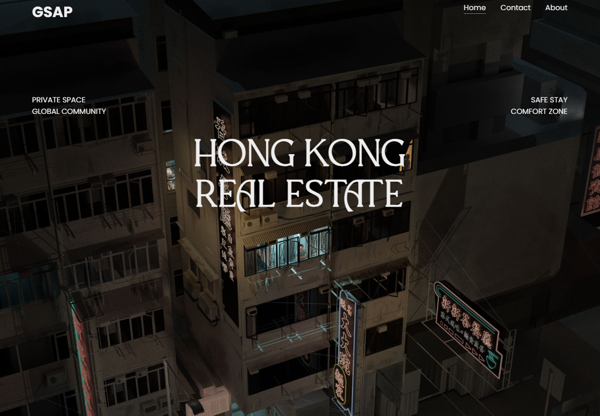

# Multilayer Parallax Scroll Animation

A simple and visually appealing **Multilayer Parallax Scroll Animation** built using HTML, CSS, and JavaScript with *
*GSAP** (GreenSock Animation Platform). This project demonstrates smooth scrolling effects and multi-layered animations
triggered by user scroll actions, creating a dynamic and engaging visual experience.

## Features

- **Smooth Parallax Scrolling**: Multiple layers move at different speeds, creating a depth effect.
- **GSAP Animations**: Leverages the power of GSAP for smooth and performant animations.
- **Scroll-Triggered Animations**: Animations triggered by scroll actions, creating an interactive experience.
- **Easy to Customize**: Modular code structure for easy customization and reuse.

## Demo

You can view a live demo of the project [here](https://multilayer-parallax-scroll.vercel.app/).

## Getting Started

### Prerequisites

To run this project locally, you need a modern web browser and a basic understanding of HTML, CSS, and JavaScript. No
additional setup is required beyond having the files available.

### Installation

1. **Clone the repository**:
   ```bash
   git clone https://github.com/username/multilayer-parallax-scroll-animation.git

2. **Navigate to the project directory:**:
   ```bash
   cd multilayer-parallax-scroll-animation

3. **Open index.html in your browser: You can open the file directly by double-clicking or using**:
   ```bash
   open index.html   # For MacOS
   start index.html  # For Windows

## Usage

Simply scroll down the page to see the parallax effect and animations. The project uses multiple layers of images and
shapes that move at different speeds, providing a visually appealing effect. The animations are smooth and fluid,
controlled by GSAP.

## Preview

<a href="https://multilayer-parallax-scroll.vercel.app">
    
</a>

### How It Works

1. **HTML**: Structure for the layers and content.
2. **CSS**: Styling and positioning for the parallax layers.
3. **JavaScript**: Uses GSAP for animation and ScrollTrigger to synchronize animations with scroll position.

### Example Code Snippet
```javascript

   gsap.registerPlugin(ScrollTrigger);
   
   let runAnimation = gsap.timeline({
       scrollTrigger: {
           trigger: "#bg_city",
           start: "top top",
           end: "+=1000",
           scrub: true,
           pin: true
       }
   });
   
   runAnimation.add([
       gsap.to("#bg_city svg", 2, { scale: 1.5 }),
       gsap.to("#full_city", 2, { opacity: 0 })
   ]);
      
```

## Customization

- **Change Animation Timing**: Modify the duration and easing of animations in the JavaScript file.
- **Add New Layers**: Easily add or adjust layers by editing the HTML and CSS.
- **Modify Scroll Effects**: Adjust the ScrollTrigger settings for different start/end points, scroll distances, and effects.

## Built With

- **HTML** - Structure of the web page.
- **CSS** - Styling and layer positioning.
- **JavaScript** - Logic and GSAP animation.
- **GSAP** - Animation library used to create smooth animations.
- **ScrollTrigger** - GSAP plugin to synchronize animations with scroll behavior.

## Contributing

Feel free to submit issues or pull requests if you have suggestions for improvements.

## Acknowledgments

- **GreenSock Animation Platform (GSAP)** - For the powerful animation tools.
- **ScrollTrigger Plugin** - For enabling scroll-based animations.
- Any tutorials, articles, or resources that helped in building the project.

